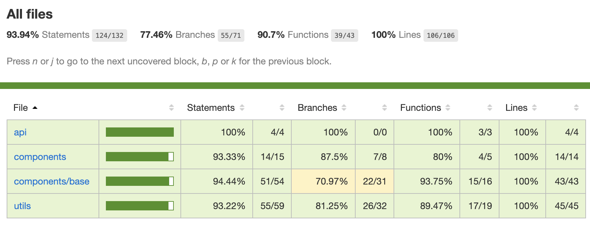
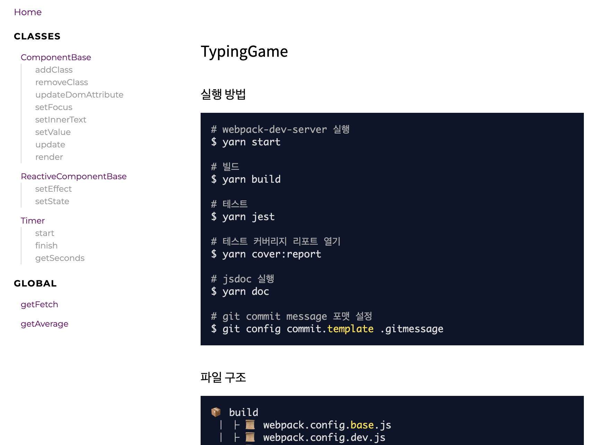

# 타자게임

주어진 단어가 표시되면 input에 단어를 정해진 시간 내에 입력하여 점수를 획득하는 어플리케이션 개발

## 기술 스택

- Vanila js
- 라이브러리는 개발환경에 필요한 설정만.
- Webpack으로 환경 구성
- unit 테스트는 라이브러리 사용가능.
- History API를 사용하여 페이지 라우팅.

## 실행 방법

```SHELL
# webpack-dev-server 실행
$ yarn start

# 빌드
$ yarn build

# 테스트
$ yarn jest

# 테스트 커버리지 확인 ($ jest --coverage)
$ yarn cover

# 테스트 커버리지 리포트 열기
$ yarn cover:report

# jsdoc 실행
$ yarn doc

# git commit message 포맷 설정
$ git config commit.template .gitmessage 
```

## 파일 구조

```TREE
📦 build
 ┃ ┣ 📜 webpack.config.base.js
 ┃ ┣ 📜 webpack.config.dev.js 
 ┃ ┗ 📜 webpack.config.prod.js
 ┃
📦 public
 ┃ ┣ index.html
 ┃ ┗ favicon.png
 ┃
📦 src
 ┣ 📂 api // api 콜을 위한 fetch API 래핑 함수
 ┃ ┣ 📜 fetch.js
 ┃ ┗ 📜 fetch.spec.js
 ┃
 ┣ 📂 components       // UI 컴포넌트
 ┃ ┣ 📂 base           // 컴포넌트 기반 클래스
 ┃ ┃ ┣ 📜 ComponentBase.js // UI 컴포넌트 모듈화를 위한 클래스
 ┃ ┃ ┣ 📜 ComponentBase.spec.js
 ┃ ┃ ┣ 📜 ReactiveComponentBase.js // state 값의 Proxy 패턴을 위한 클래스
 ┃ ┃ ┗ 📜 ReactiveComponentBase.spec.js
 ┃ ┃
 ┃ ┣ 📜 ConfetiComponent.js // 완료페이지 꽃가루 효과를 위한 UI 모듈
 ┃ ┣ 📜 GameControlButton.js      // 시작 / 초기화 버튼
 ┃ ┣ 📜 GameControlButton.spec.js  
 ┃ ┣ 📜 WordInput.js              // 단어 입력 인풋 폼
 ┃ ┗ 📜 WordInput.spec.js
 ┃  
 ┣ 📂 pages
 ┃ ┣ 📜 GamePage.js       // 게임 페이지
 ┃ ┗ 📜 ScorePage.js      // 완료페이지
 ┃
 ┣ 📂 styles
 ┃ ┣ 📜 confeti.scss
 ┃ ┣ 📜 index.scss
 ┃ ┗ 📜 reset.scss
 ┃
 ┣ 📂 utils
 ┃ ┣ 📜 getAverage.js       // array의 평균을 구하는 함수
 ┃ ┣ 📜 getAverage.spec.js
 ┃ ┣ 📜 timer.js            // 타이머 구현 클래스
 ┃ ┣ 📜 timer.spec.js
 ┃ ┣ 📜 vDom.js             // DOM 조작 추상화 함수들
 ┃ ┗ 📜 vDom.spec.js
 ┃
 ┣ 📜 index.js
 ┣ 📜 router.js             // History API를 이용한 라우팅
 ┗ 📜 router.spec.js
```

## 환경 구성 : Webpack

- webpack.config.dev.js / webpack.config.prod.js 으로 개발 / 배포 설정 분리.
- 공동 설정은 webpack.config.base.js
- ```$ yarn start``` script를 통해서 hot-loading 적용.
- ```$ yarn build``` script를 구성하여 /public 폴더에 빌드한 html, js, css를 export.
- build 한 js 파일이 111KB. 크지 않아 chunck로 나누지 않음.
- .env 파일 환경 설정은 필요 없어서 설정 안함.

## 작업 환경 구성 : Eslint, Prettier, Husky

Husky hook precommit 옵션을 설정하여

1. eslint 검사
2. prettier 수정
3. 커밋 대상인 파일과 관련된 *.spec.js파일의 jest 검사

이후에 에러 없을 시 커밋할 수 있게 구성.

## View - ViewModel 분리

> src/page는 뷰모델의 역할에만 집중.
> src/components/xxComponent 는 뷰의 역할에만 집중.

- ReactiveComponent 클래스 정의
  - 목적 : GamePage가 상속받아 사용. *ViewModel* 역할에 집중할 수 있게하게 위해 만듦. View - ViewModel을 분리해서 View의 디스플레이 로직에 관심없이 page가 state관리와 비즈니스 로직에만 관심있게 하기위해 디자인 함.
  - 동작방식
    - Proxy API를 사용하여 Proxy 패턴으로 state의 속성값을 변경할때 setEffect함수로 등록된 특정액션(콜백)을 실행함.
    - setEffect(Callback, [...stateName]) 함수로 this.state[stateName]값이 변경될 때 Callback을 실행시킴
    -  좀 더 명시적으로 상태값을 수정하기 위해 this.state 변경시에 this.setState() 매서드를 사용함.
- ComponentBase 클래스 정의
  - 목적 : *View* 역할. UI 컴포넌트 모듈화를 위한 클래스. ReactiveComponent와는 반대로 전달받은 상태값(props)의 변화에 따라 변경되는 디스플레이 로직에 집중.
  - 동작 방식
    1. 여러가지 DOM Attribute, event를 정의하고 수정할 때 사용할 수 있는 render, update 매서드를 제공. 가독성을 높임.
    2. Dom Attribute의 이전 속성을 비교해 변경시에만 업데이트 함.   ```ComponentBase.updateDomAttribute()```

## UI 렌더링

- ```<div id="app"></div>```에 페이지 DOM Node를 한번에 렌더링 하는 방식.
  - 페이지 클래스를 한번에 생성하지 않고 방문한 페이지들만 생성
    ```javascript
    function getPathLazy(pathName) {
      if (!routesMemo[pathName]) routesMemo[pathName] = routeMap[pathName]();
      return routesMemo[pathName];
    }
    ```
- vDom.js에 createElement를 래핑하는 함수를 만듦.
  1. render 함수안의 Dom의 위치를 표현
  2. createElement 매서드를 가독성을 높임

### 백엔드 API 요청

- 요청 API가 하나만 존재하므로 .env 같은 환경변수로 관리 안하고 요청시 url 만 넣으면 작동하게 진행.
  코드 가독성을 높이기 위해 src/api/fetch.js의 getFetch 함수로 정의.

### 라우팅

- History API를 사용해서 history.pushState(data,title,url)로 history.state에 전달할 상태값을 data인자에 담아 다음 화면을 렌더링할 때 해당 data 값을 사용함. - 관련 테스트 src/router.spec.js
- 게임 화면에서 게임을 완료했을때 History API를 사용하여 브라우저의 세션 기록을 조작함
  ```javascript
    historyRouter(ROUTE_PATH.ScorePage, { score, averageTime });
  ```
  완료 페이지에선 위 데이터(```score```, ```avewrageTime```)를 받아(history.state.score, history.state.score) DOM Node를 만들때 넣어줌.
- window.onpopstate 에 페이지 전환시(history.back, history.go, history.forward) renderHTML 함수를 실행시켜서 화면을 렌더링 함.
- 이미 생성한 페이지는 해당 경로로 들어왔을 때 이전 상태 그대로 랜더링함. (게임 시작 이후에 score 페이지로 갔다가 뒤로가기를 눌러도 게임이 살아있게 만듦.)

### 단위 테스트 - jest & jest-dom

- 테스트 커버리지 (```$ yarn cover``` 의 결과)

| Statements                  | Branches                | Functions                 | Lines                |
| --------------------------- | ----------------------- | ------------------------- | -------------------- |
|  |  |  |     |

- 대상
  - components(CSS 효과 구현을 위한 ConfettiComponent는 제외)
  - utils
  - router
  - api

- 세부 내용
  - **utils**
    - src/utils/vDom.spec.js : createElement를 추상화하여 쓰기 위한 vDom 함수 테스트
    - src/utils/timer.spec.js : 남은 시간 카운트를 위한 클래스인 Timer의 테스트
    - src/utils/getAverage.spec.js : ```[...걸린시간]```의 평균 계산을 위한, Array에서 평균값을 리턴하는 함수 테스트
  - **components**
    - src/components/base/ReactiveComponentBase.spec.js : State 값을 Proxy하여 setEffect 매서드로 등록한 콜백을 실행시키기 위한 클래스
    - src/components/base/ComponentBase.js
      - 목적 : 컴포넌트 모듈화를 위해 도입. DOM Element를 조작하는 컴포넌트 클래스 테스트.
      - 점수판, 남은 시간, 문제 단어에 사용.
      - 주요 기능
        1. 여러가지 DOM Attribute, event를 정의하고 수정할 때 사용할 수 있는 render, update 매서드를 제공. -> 가독성을 높임.
        2. Dom Attribute의 이전 속성을 비교해 변경시에만 업데이트 함.
    - src/components/GameControlButton.js : GameControlButton 컴포넌트 클래스 테스트
    - src/components/WordInput.js : WordInput 컴포넌트 클래스 테스트
  - **router**
    - src/router.spec.js : History API가 의도한 방식대로 작동하는지 mock 테스트
  - **api**
    - src/api/fetch.spec.js : Fetch API로 만든 getFetch 함수의 mock 테스트

테스트 커버리지 리포트 확인 명령어

```SHELL
$ yarn cover:report
```


## ETC

#### git 작업방식

- 커밋 메시지 포맷 : .gitmessage
- 브랜치 전략 : git flow
- 150여개의 커밋

#### Micro Interaction 요소

- 단어가 틀렸다는 것을 유저 경험에 녹여내기 위해 WordInput 에 입력한 단어가 틀렸을 경우 0.5초 동안
  - wiggle animation 추가
  - input background color 변경
  - 그 다음 input value empty 상태로 변경

#### 디자인 요소 추가

- 유저의 완료 후 성취감을 더 높이기 위해 백그라운드 꽃가루 이펙트를 css로 구현.

#### JSdoc

- jsdoc으로 구현한 컴포넌트 클래스, 유틸 함수들을 편하게 보기위해 문서화 툴 jsdoc을 사용함.

```SHELL
$ yarn doc
```



### 과제 설명

- ✅  확장성, 모듈화, 선언형 프로그래밍에 초점.
- ✅  ViewModel과 컨테이너 역할을하는 GamePage, ScorePage 와 View와 프레즌테이션 컴포넌트 역할을 할 components로 분화.

### 아쉬운 점

- ✅  리액트의 Reconciliation(재조정) 과정이 없어서 효율적이지 않음. 리플로우, 리페인팅이 많이 일어남. 추상화한다는 의미에서의 가상돔 개념만 가져왔음.
- ✅  오프스크린 컴포넌트의 메모리 해제 - 사용하지 않는 route의 메모리 해제 기능이 없음. 앱이 커질 것을 감안해 가비지 컬렉션을 잘 하기 위해 추가적으로 사용하지않은 라우트를 해제하는 로직을 구현해야 할 것 같음.

### 리엑트 따라잡기

[링크](https://velog.io/@xortm854/React-Hooks-%EB%8F%99%EC%9E%91-%EB%B0%A9%EB%B2%95)

```javascript
const React = (function(){
  const hooks = [];
  let currentHook = 0;
  return {
    render(Component){
      const component = Component();
      component.render();
      return component;
    },
    useState(initialValue){
      hooks[currentHook] = hooks[currentHook] || initialValue;
      const setState = function(newValue){
      	hooks[currentHook] = newValue;
      }
      return [hooks[currentHook++], setState];
    },
    useEffect(callback,newList){
      const checkAlways = !newList //newList값이 특정되지않았으면 매번 Callback 실행
      const list = hooks[currentHook];
      const checkList = list ? !list.every((now,idx)=> now === newList[idx]): true;
      if(checkAlways || checkList){
        callback();
        hooks[currentHook] = newList;
      }
      currentHook++;
    }
  }
})()
```
